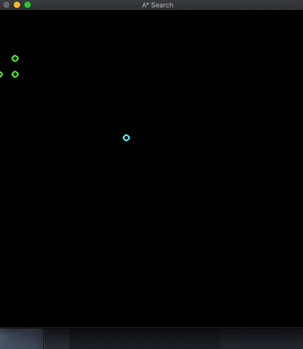
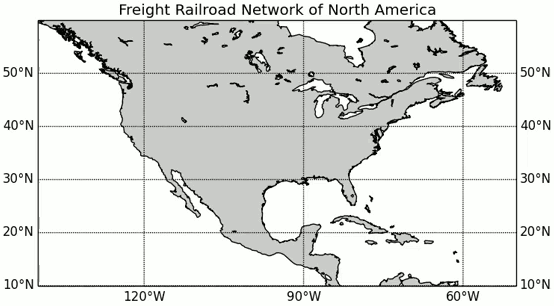
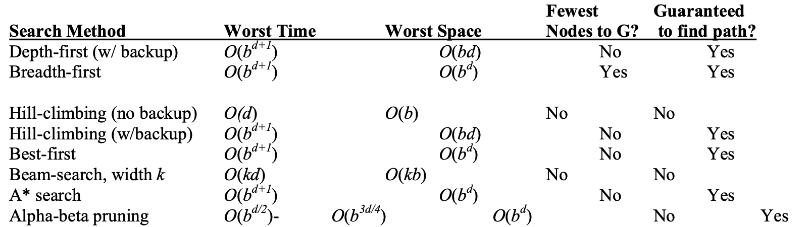

# AStar-Search-ModernCpp

A library implementing A* algorithm with modern C++ syntax and using OpenCV for simulation


## Getting Started
To define an A* agent.

Let's say you want to solve a path planning problem with the help of A*. You want to reach a goal coordinate of (x,y). You can train an agent to reach this goal using the following code. 
```cpp
#include <iostream>
#include "Astar.hpp"
#include "draw.hpp"


int main()
{   

    Astar A(0,3); // initial position of the agent
    A.SetGoal(9,9); // goal position of the agent
    A.Implementation(); // starts search loop
    return 0;
}

```
The following defines an A* agent with 2 state variables (x,y) <br/>
0<= x <= 10 <br/>
0<= y <= 10 <br/>


The A.SetGoal() static function defines the goal coordinates of the agent.

```cpp
A.SetGoal()
```
The following function starts the path planning loop. <br/>

```cpp
A.Implementation()
```


## Example
The A* algorithm also has real-world applications. In this example, edges are railroads and h(x) is the great-circle distance (the shortest possible distance on a sphere) to the target. The algorithm is searching for a path between Washington, D.C. and Los Angeles.



## Heuristic 
There are numerous heuristics that can be used in path planning algorithms. Use what is suitable for your problem. 
```cpp
/*
Heuristic funtion. Should be modified according to the problem.
Current heuristic is (x1-x2)^2 + (y1-y2)^2
*/
double Heuristic(const PointI &a, const PointI &b)
{
    return 10 * std::sqrt(((std::get<0>(a) - std::get<0>(b)) ^ 2 + (std::get<1>(a) - std::get<1>(b)) ^ 2));
};
```
## Complexity
 (Source : http://www.ai.mit.edu/courses/6.034b/searchcomplex.pdf)

## Contributing
This repository is in it's beginning stages. The goal of this project is to use the speed and efficiency of C++ along with its modern syntax to provide a simple interface for the user to test his/her algorithms. If you feel you are interested in contributing please send me an email as I am still in the process of finalizing a "how to contribute?" guidelines. Thank you :)

### Prerequisites
OpenCV <br/>
C++ 17 <br/>
cmake <br/>

### Installing
Installing OpenCV: <br/>
**[Install HomeBrew]**:
```
/usr/bin/ruby -e "$(curl -fsSL https://raw.githubusercontent.com/Homebrew/install/master/install)"
```
**[Install OpenCV]**: <br/>
```
brew install opencv
```

**[Install pkg-config]**:<br/>
```
brew install pkg-config
```
Clone the repo:
```
git clone https://github.com/gautam-sharma1/AStar-Search-ModernCpp.git

```
### Running
```
cd AStar-Search-ModernCpp
cd build
cmake .. && make
./main
```


## Built With

* [OpenCV](https://docs.opencv.org/3.4/) - Used for Visualization


## Authors

* **Gautam Sharma** - *Initial work* - [Github](https://github.com/gautam-sharma1)
* Please leave a star if you find this repo interesting!


## License

This project is licensed under the MIT License - see the [LICENSE.md](LICENSE.md) file for details


